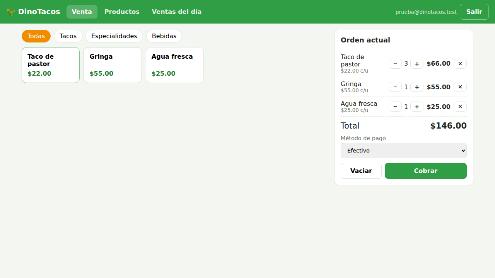
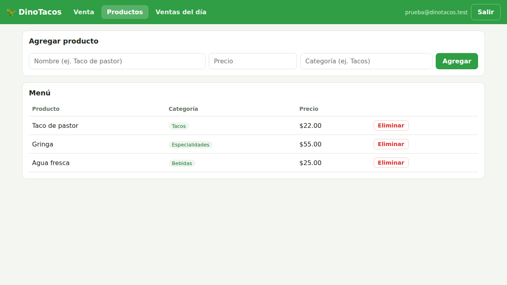
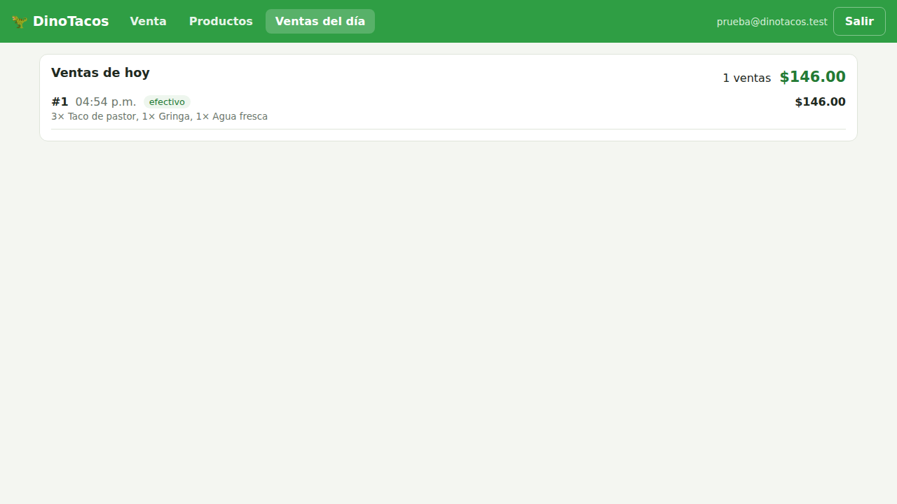

# 🦖 DinoTacos · Punto de venta

Punto de venta sencillo para el restaurante DinoTacos, conectado a su propio proyecto de Supabase (`dinotacos`, ref `vkiixgxhmqdzibylnxyy`).

## Qué hace

- **Venta**: tocas productos del menú para agregarlos a la orden, ajustas cantidades con − / +, quitas productos con ✕, eliges método de pago y cobras.
- **Productos**: agregas productos al menú (nombre, precio, categoría) y los eliminas.
- **Ventas**: historial por día guardado en Supabase. Muestra las ventas de hoy con su detalle, el total y el desglose por método de pago; con ◀ ▶ o el calendario consultas cualquier día anterior, y la lista "Últimos 30 días" muestra el total de cada día (tócalo para ver su detalle).

## Cómo correrlo

No necesita compilarse: son archivos estáticos (HTML, CSS y JS) que funcionan tal cual.

- **En línea**: https://danieldavb.github.io/dino_punto_de_venta/ (GitHub Pages con GitHub Actions: cada push que cambia la app se publica solo con `.github/workflows/pages.yml`, y también se puede lanzar a mano desde la pestaña Actions).
- **En tu computadora**: `npm install` y `npm run dev`, luego abre http://localhost:5173.

La URL y la clave publicable de Supabase están en `src/config.js`. La librería de Supabase va incluida en `vendor/supabase.js`; para actualizarla: `npm update @supabase/supabase-js && npm run vendor`.

## Crear usuarios para el personal

Solo usuarios con sesión iniciada pueden ver o modificar datos. Para dar acceso a un empleado, en [Supabase → Authentication → Users](https://supabase.com/dashboard/project/vkiixgxhmqdzibylnxyy/auth/users):

- **Add user → Send invitation**: le llega un correo; al abrir el enlace entra a la app y crea su contraseña.
- **Add user → Create new user**: tú escribes correo y contraseña y marcas **Auto Confirm User**.

Si alguien olvida su contraseña, toca **¿Olvidaste tu contraseña?** en la pantalla de acceso y recibe un correo para crear una nueva.

Para que los enlaces de los correos abran la app, en [Authentication → URL Configuration](https://supabase.com/dashboard/project/vkiixgxhmqdzibylnxyy/auth/url-configuration) la **Site URL** debe ser `https://danieldavb.github.io/dino_punto_de_venta/` y esa misma dirección debe estar en **Redirect URLs**.

## Base de datos

El esquema está en `supabase/migrations/` (ya aplicado al proyecto):

| Tabla | Para qué |
| --- | --- |
| `productos` | El menú (nombre, precio, categoría) |
| `ventas` | Cada venta cobrada (total, método de pago, quién la hizo) |
| `venta_items` | Productos de cada venta; guarda nombre y precio del momento, así borrar un producto no altera el historial |

Las ventas se registran con la función `registrar_venta`, que toma los precios directamente de la tabla `productos` para que el total no se pueda alterar desde el navegador. Todas las tablas tienen Row Level Security activado.

## Capturas

| Venta | Productos | Ventas del día |
| --- | --- | --- |
|  |  |  |
